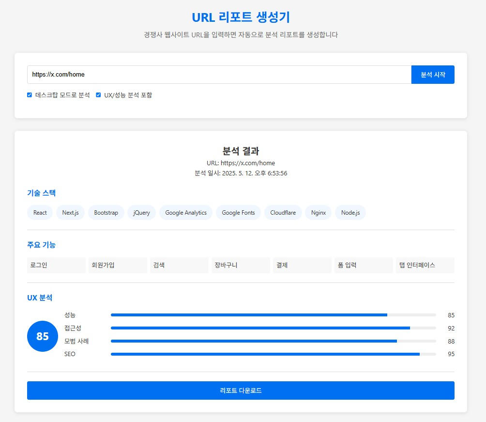

<div align="center">
  
</div>

# URL 리포트 생성기 (URL Report Generator)

경쟁사 URL만 입력하면 자동으로 웹사이트를 분석하여 리포트를 생성하는 도구입니다.

## 주요 기능

- **URL 입력**: 경쟁사 웹사이트 주소 입력 (데스크탑/모바일 기준 선택 가능)
- **페이지 구조 분석**: 메뉴 구조, 페이지 흐름 자동 추출
- **기능 분석**: 로그인, 회원가입, 검색 등 주요 기능 자동 감지 및 동적 추가
- **기술 스택 분석**: 프레임워크, CMS, JS 라이브러리, 웹 서버 등 사용 기술 감지
- **UI/UX 요소 분석**: 성능, 접근성, 모범 사례, SEO 등 분석 및 시각화
- **리포트 생성**: 결과를 PDF 형태로 출력 및 다운로드
- **흐름도 시각화**: 주요 기능의 흐름을 Mermaid.js를 활용하여 시각화

## 설치 방법

```bash
# 패키지 설치
npm install
```

## 서버 실행 방법

### 서버 실행
```bash
# 서버 실행 (3000 포트)
node server.js
```

서버가 실행되면 웹 브라우저에서 `http://localhost:3000`으로 접속하여 애플리케이션을 사용할 수 있습니다.

## 사용 방법

1. 웹 브라우저에서 `http://localhost:3000` 접속
2. 분석할 URL 입력 (예: https://www.naver.com)
3. 옵션 선택 (데스크탑 모드, UX 분석 포함)
4. '분석 시작' 버튼 클릭
5. 분석 결과 확인
   - 기술 스택: 사용된 기술 목록 확인
   - 주요 기능: 감지된 기능 확인 (클릭하면 흐름도 표시)
   - UX 분석: 성능, 접근성, 모범 사례, SEO 점수 확인
6. 'PDF 다운로드' 버튼을 클릭하여 분석 결과를 PDF로 저장

## 기술 스택

- **프론트엔드**: HTML, CSS, JavaScript
- **백엔드**: Node.js (Express)
- **데이터 처리**: JSON
- **PDF 생성**: jsPDF, html2canvas
- **시각화**: Mermaid.js
- **UX 분석**: 성능, 접근성, 모범 사례, SEO 점수 시각화

## 프로젝트 구조

```
├─ public/            # 정적 파일
│   ├─ css/           # CSS 스타일
│   │   └─ styles.css  # 주요 스타일
│   ├─ js/            # JavaScript 파일
│   │   ├─ main.js     # 주요 애플리케이션 로직
│   │   ├─ modal.js    # 모달 창 관리
│   │   └─ flowcharts.js # 흐름도 데이터
│   └─ index.html    # 메인 HTML 파일
├─ server.js         # 서버 애플리케이션
├─ server/            # 서버 관련 파일
│   └─ analyzer/      # 웹사이트 분석 모듈
│       ├─ websiteAnalyzer.js # 웹사이트 구조 분석
│       ├─ techAnalyzer.js    # 기술 스택 분석
│       └─ uxScorer.js        # UX 점수 분석
└─ package.json      # 프로젝트 설정 및 의존성
```

## 라이센스

MIT